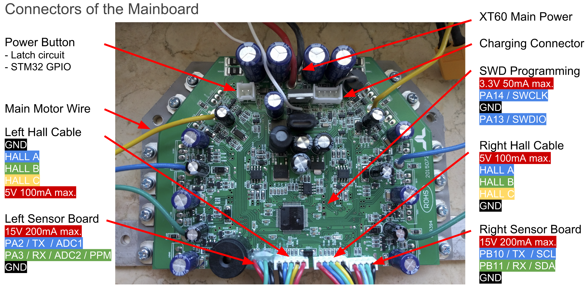

This firmware is a heavily modified version of [Niklas Fauth's hoverboard firmware](https://github.com/NiklasFauth/hoverboard-firmware-hack) which allows you to:
 * Use the hoverboard AS A HOVERBOARD
 * Control externaly the hoverboard with a reliable serial protocol.

This project was started by [btsimonh](https://github.com/btsimonh)

It branched from Niklas Fauth's hoverboard firmware at this commit: [Aug 24, 2018](https://github.com/bipropellant/hoverboard-firmware/commit/28287b9acc53b68ff4dede0de61852188838da51)

# Added:

### Software serial:
This allows you to use ANY GPIO pins (with modififcation) as serial.  Probably best to stay at 9600 baud, as the receive interrupt is serviced at 8x the bitrate.

### Sensor reading:
It reads the original serial data (9 bit) from the original sensor boards from USART2&3.

### Sensor control:
Sensor data can control the PWM demands (power to the wheels).  Double tap on pads to enable.

### Serial diagnostic control:
Protocol.c implements a [simple ASCII serial protocol](https://github.com/bipropellant/hoverboard-firmware/wiki/Simple-ASCII-interface) which allows for manual control of the board.

### Serial Machine control:
Protocol.c implements the bones of an acked/checksummed serial protocol.  Embryonic as yet, but intended to be a generic control protocol for the hoverboard.

### PID Control:
PID control loops for control of Speed (in mm/sec) and Position (in mm).  Currently separate control modes, and parameter need better tuning.

### Hall Interupts:
Used to read Position and Speed data.

### Flash settings:
Implements a flash page available for efficitent storage of parameters (currently unused, but tested).

*Should work with original control settings (in config.h), but not tested...*

# Hardware

The original Hardware supports two 4-pin cables that originally were connected to the two sensor boards. They break out GND, 12/15V and USART2&3 of the Hoverboard mainboard.
Both USART2 & 3 can be used for UART and I2C, PA2&3 can be used as 12bit ADCs.

The reverse-engineered schematics of the mainboard can be found here:
http://vocke.tv/lib/exe/fetch.php?media=20150722_hoverboard_sch.pdf

# Building and flashing
The repository uses a submodule for the serial protocol.
Clone with submodules: ´git clone --recurse-submodules´
Or afterwards: ´git submodule update --init --recursive´

[Take a look at our wiki](https://github.com/bipropellant/hoverboard-firmware/wiki/Building-and-flashing)

# Any other problems?
First [take a look at our wiki](https://github.com/bipropellant/hoverboard-firmware/wiki) and [open issues](https://github.com/bipropellant/hoverboard-firmware/issues), if you still have any problem/question, feel free to [open a new issue](https://github.com/bipropellant/hoverboard-firmware/issues/new)!
